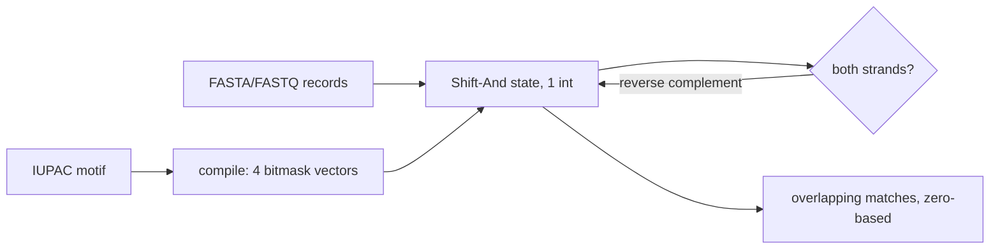

# iupac-scan

[](https://github.com/bmouler/iupac-scan/actions/workflows/ci.yml)


[](LICENSE)

`iupac-scan` streams FASTA and conventional four-line FASTQ records and finds overlapping degenerate DNA motifs on one or both strands. It has no runtime dependencies and makes no network requests.

## Install

```console
python -m pip install iupac-scan
```

For development:

```console
python -m pip install -e '.[dev]'
```

## Quickstart

```console
$ iupac-scan 'ATN' reads.fasta --both-strands
record_id	start	end	strand	matched_sequence
read1	0	3	+	ATG
read1	4	7	-	CAT
```

Coordinates are zero-based, half-open `[start, end)`, and always refer to the input record's orientation. Output defaults to TSV; `--output-format jsonl` emits one JSON object per match. Use `-` or omit the input path to read stdin, `-o PATH` to write a file, and `--input-format fasta|fastq` to override detection.

Python API:

```python
from iupac_scan import compile_motif, scan_sequence

motif = compile_motif("RYN")
for match in scan_sequence("ACGTN", motif, both_strands=True):
    print(match.start, match.end, match.strand, match.sequence)
```

## Exact ambiguous-symbol semantics

Every IUPAC symbol is a set of canonical DNA bases: `A=A`, `C=C`, `G=G`, `T=T`, `U=T`, `R=AG`, `Y=CT`, `S=CG`, `W=AT`, `K=GT`, `M=AC`, `B=CGT`, `D=AGT`, `H=ACT`, `V=ACG`, and `N=ACGT`. Matching is case-insensitive. A motif position and sequence position match exactly when their sets intersect, so an ambiguous input symbol can match an ambiguous motif symbol. `U` is treated as `T`; this is still a DNA scanner, not an RNA reverse-complement tool.

Matches may overlap. With `--both-strands`, the motif and its reverse complement are scanned independently. A palindromic motif therefore produces both `+` and `-` output at the same coordinates. The matched sequence is reported exactly in the forward input orientation, normalized to uppercase.

## Algorithm



Compilation converts each motif character to a four-bit `A/C/G/T` mask, then transposes the motif into four Python-integer bit vectors. Scanning applies Shift-And: one integer state shift and compatibility intersection per sequence symbol. Degenerate sequence symbols combine up to four precompiled vectors. Motif degeneracy does not expand into concrete motifs and does not alter asymptotic scan cost; scan time is `O(n)` Python iterations with `O(m)` compilation/storage, where `n` is sequence length and `m` is motif length. Python big-integer operations still scale with the motif's machine-word width.

## Reproducible local evidence

`benchmarks/benchmark.py` compares Shift-And with a correct expansion-free nested-loop baseline. Both implementations first verify identical match coordinates. The workload is generated with `random.Random(20260812)`: 200,000 canonical bases, one deterministic compatible motif instance inserted at the midpoint, the fixed 32-symbol highly degenerate motif `BDHVNRYKMSWBDHVNRYKMSWBDHVNRYKMS`, and seven timed repeats.

On an Apple M3 Max using the system Python 3 on 2026-08-12, median times from:

```console
python benchmarks/benchmark.py
```

were **0.0546 s for Shift-And** and **0.0795 s for the nested loop**, a **1.46x speedup**, with identical coordinates (one match for this seeded workload). These numbers are local evidence, not a portability guarantee; rerun the command on the target machine. JSON output includes every benchmark parameter and raw median values.

## Verification

### Mutation testing

From the repository root, reproduce the mutation run with:

```console
source .venv/bin/activate
mutmut run
mutmut results
```

The run generated **498 mutants**, of which **491 were killed (98.59%)**. The seven remaining survivors were individually reviewed and are behavior-equivalent, not missed mutants. There were **zero suspicious mutants and zero timeouts**.

| Behavior-equivalent rationale | Count |
| --- | ---: |
| Bitmask bits discarded by subsequent shifts | 2 |
| Identifier split `maxsplit` variant with identical output | 1 |
| Initialization sentinel variants with identical observable behavior | 2 |
| Duplicate characters in `rstrip` character sets | 2 |

## Limitations

- FASTQ parsing intentionally accepts the widespread four-line form only; wrapped sequence or quality lines are rejected.
- FASTA sequence lines may wrap, but whitespace inside sequence lines is not removed and is reported as an invalid DNA symbol.
- Record IDs beginning with `=`, `+`, `-`, or `@` are rejected so default TSV output is safe from spreadsheet formula interpretation.
- Quality scores are length-validated but otherwise ignored.
- Inputs are decoded as UTF-8 and symbols outside the documented alphabet are errors.
- Very long motifs remain correct, but Python big-integer work grows with motif length.
